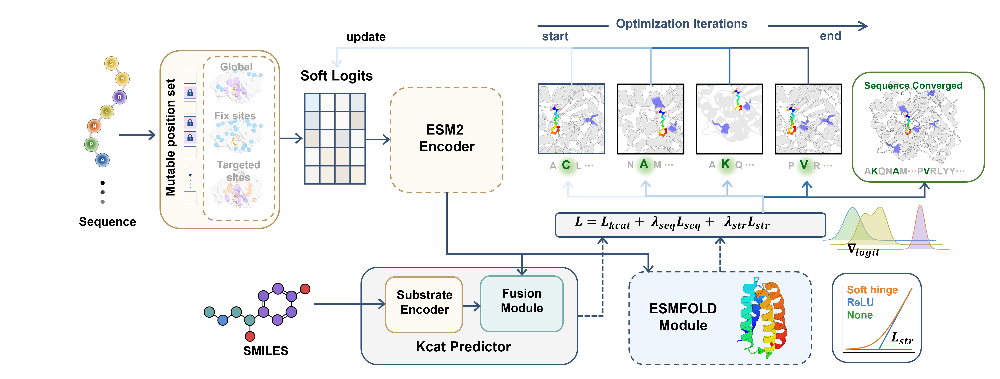

<p align="center">
  
</p>

## 🌿 Overview



CatESO builds on an enzyme–small-molecule modeling framework, adds a sequence-optimization module based on ESM-2 soft tokens, and vendors the `esm` / `openfold` source into the repo for offline / cluster use. It does three main things:

- **Kinetics prediction**: given an enzyme sequence and a substrate molecule, regress its `kcat`.
- **Sequence optimization**: use the trained CatESO ensemble as the objective and optimize the enzyme sequence by gradient.
- **Structure constraint**: optionally plug in ESMFold during optimization, using pLDDT / pTM to avoid generating unstable sequences.

Two main entry points:

- `main_ensemble.py` — train / evaluate the CatESO model (substrate molecular graph + precomputed protein embedding).
- `main_optimize.py` — load a `.pth` checkpoint and run Gumbel-Softmax optimization on an initial enzyme sequence.

## 🖥️ Installation

The whole environment (conda spec + all pip deps) is embedded in a single script; install in one step:

```bash
bash scripts/setup_env.sh
```

## 🚀 Usage

### Prediction (`inference.py`)

`inference.py` runs **ensemble** inference: it loads *every* checkpoint in `--ckpt_dir`, predicts the
whole split once per model, and averages the predictions in log10(`kcat`) space.

```bash
python inference.py \
    --split_csv embedding/CatPred/test.csv \
    --out_csv   predict.csv
```

### Training

1. Use `esm2_t36_3B_UR50D` to generate a residue embedding for each unique protein sequence. **First download the 3B weight** (~5.3 GB) into `$ESM_CKPT_DIR/hub/checkpoints/`:

```bash
export ESM_CKPT_DIR=/scratch/$USER/esm/ckpt          # shared with embedding.py / main_optimize.py

mkdir -p "$ESM_CKPT_DIR/hub/checkpoints"

cd "$ESM_CKPT_DIR/hub/checkpoints"

wget https://dl.fbaipublicfiles.com/fair-esm/models/esm2_t36_3B_UR50D.pt

wget https://dl.fbaipublicfiles.com/fair-esm/regression/esm2_t36_3B_UR50D-contact-regression.pt
```

2. **Lay out the raw data.** `embedding.py` reads `<data_dir>/CatPred/{train,val,test}.csv`

```
datasets/CatPred/{train,val,test}.csv
```

3. **Generate embeddings.** 

```bash
python scripts/embedding.py \
  --data_dir ./datasets \
  --feat_dir ./embedding \
  --esm_ckpt "$ESM_CKPT_DIR/hub/checkpoints/esm2_t36_3B_UR50D.pt"
```

4. **Point the configs at the embedding output.** Set `SOLVER.DATA` in both
   `configs/model1/data.yaml` and `configs/model2/data.yaml` (an absolute path avoids
   cwd-dependent breakage):

```yaml
SOLVER:
  DATA: '/abs/path/to/CatESO-main/embedding/CatPred'
```

5. **Train.**

```bash
torchrun --nproc_per_node=4 --master_port=29500 --standalone main_ensemble.py \
    --model configs/model1/model.yaml \
    --data  configs/model1/data.yaml \
    --task  regression
```

6. **Testing.** Two options — see [Testing](#testing-test_resultspy) for `test_results.py` (the
   easier one: it reads the checkpoint layout training already writes, and adds OOD metrics), or
   [Prediction](#prediction-inferencepy) for `inference.py` (writes a prediction CSV, but needs the
   checkpoints renamed first).

### Testing (`test_results.py`)

`test_results.py` ensembles across configs and reports metrics **stratified by sequence-identity
OOD bucket** (the CatPred protocol). 

```bash
export PYTHONPATH="$PWD/run:$PWD:$PYTHONPATH"     # needed (unlike inference.py)
python test_results.py 
```

### Sequence optimization (`main_optimize.py`)

Differentiable (Gumbel-Softmax) optimization of the enzyme sequence, with the CatESO ensemble as the
objective and an optional ESMFold structure constraint. 

```bash
export ESM_CKPT_DIR=/scratch/$USER/esm/ckpt     # main_optimize.py sets TORCH_HOME from this

python -u main_optimize.py \
    --model configs/optimization/CatESO.yaml \
    --opt_yaml configs/optimization/default_fixed.yaml \
    --ensemble_ckpt_dir ./ensemble_ckpt
```

> see **[Sequence Optimization Parameters](optimizer/OPTIMIZATION_PARAMS.md)**.

## ⚖️ Weights & third-party code

- CatESO ensemble checkpoints: the repo already provides `model_{seed}_M{k}.pth` under `ensemble_ckpt/`.
- ESM-2 / ESMFold ([facebookresearch/esm](https://github.com/facebookresearch/esm)) weights must be placed in the local cache dir `$ESM_CKPT_DIR/hub/checkpoints/` (`TORCH_HOME` / `ESM_CKPT_DIR` point to the same dir). Download URLs (`https://dl.fbaipublicfiles.com/fair-esm/`):
  - `models/esm2_t36_3B_UR50D.pt` (for embedding; see the download step under Training)
  - `models/esmfold_3B_v1.pt` (ESMFold, for structure-constrained optimization)
- The repo vendors `esm` ([facebookresearch/esm](https://github.com/facebookresearch/esm)), `esm_source`, and `openfold` ([aqlaboratory/openfold](https://github.com/aqlaboratory/openfold)), each under its upstream license.
- The framework design follows OmniESI ([Hong-yu-Zhang/OmniESI](https://github.com/Hong-yu-Zhang/OmniESI)).

## Citation
if you find our work helpful, please consider to star the repo and cite our paper 😊
```
@article{gan2026cateso,
  title={CatESO: Differentiable Enzyme Sequence Optimization Guided by Substrate-Aware kcat Prediction},
  author={Gan, Zhenjia and Xu, Yuzhi and Xu, Junde and Wu, Zhihao and Huang, Juping and Yin, Jiabin and Chen, Guangyong and Zhang, John ZH},
  journal={bioRxiv},
  pages={2026--07},
  year={2026},
  publisher={Cold Spring Harbor Laboratory}
}
```
